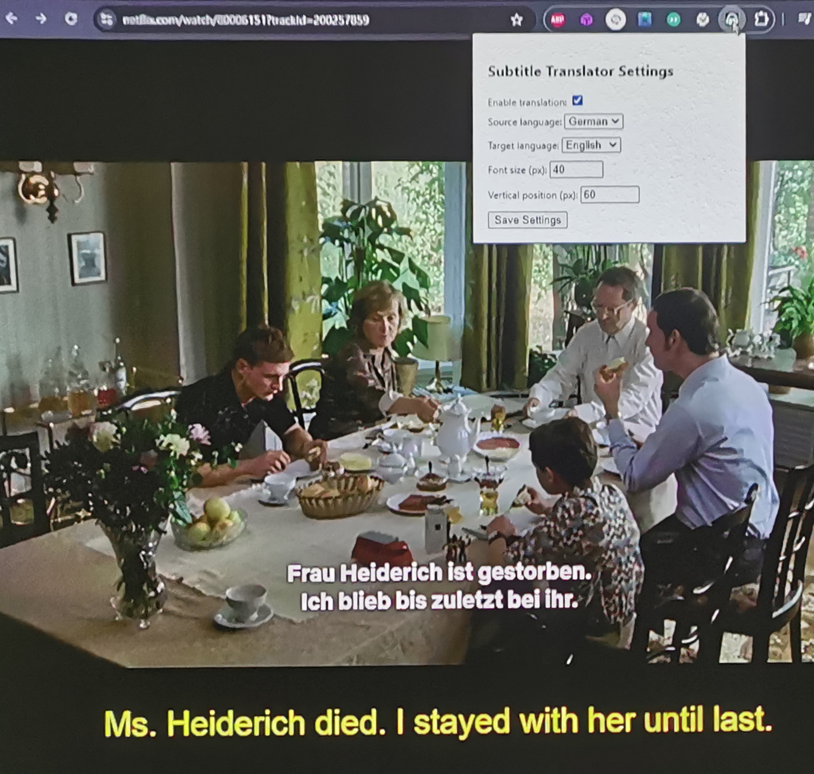

# Chrome Netflix parallel translation extension

This Chrome extension adds real-time translation capabilities to Netflix subtitles, allowing users to view parallel subtitles in their preferred language during language learning, for example.

<div align="center">
  
</div>

## Features

- Real-time translation of Netflix subtitles
- Customizable font size and position for translated subtitles
- Support for multiple languages
- Uses LibreTranslate for translations

## Installation

1. Clone this repository or download the ZIP file.
2. Open Chrome and go to `chrome://extensions/`.
3. Enable "Developer mode" in the top right corner.
4. Click "Load unpacked" and select the `src` folder from this project.

## Usage

1. Open a video on Netflix.
2. Click the extension icon to open the settings popup.
3. Choose your source and target languages, adjust font size and position as needed.
4. Enable translation and enjoy your video with translated subtitles!

## Configuration

The extension currently uses a local LibreTranslate server for translations. The server URL is hardcoded in the `translate.js` file:

```javascript
const apiUrl = 'http://localhost:5000/translate';  // LibreTranslate server URL
```

Make sure to set up and run a LibreTranslate server locally before using the extension.

## Upcoming Features

- YouTube subtitle translation support
- Integration with Azure Translation API

## Contributing

Contributions are welcome! Please feel free to submit a Pull Request.

## License

This project is licensed under the MIT License - see the [LICENSE](LICENSE) file for details.
