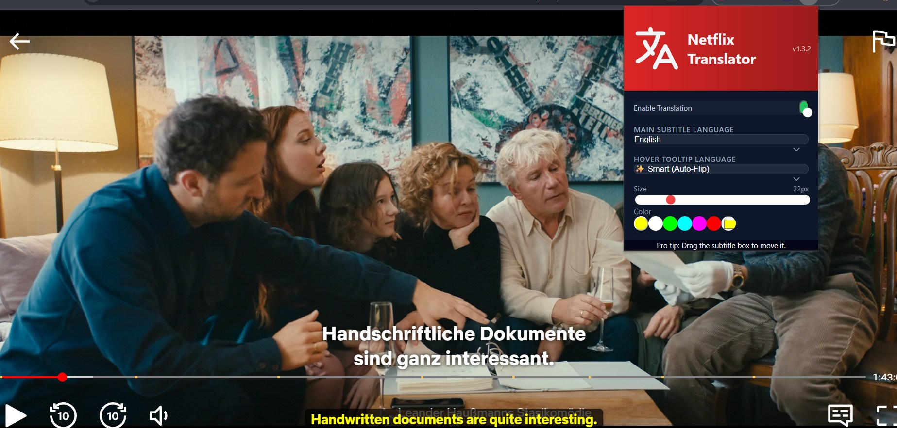

# Netflix Parallel Translation (Chrome Extension)

A powerful Chrome Extension that adds a secondary, parallel subtitle track to Netflix. Perfect for language learners who want to see their native language and the target language simultaneously.


*(See 'Screenshots' section below for more previews)*

## 🌟 Key Features

*   **Dual Subtitles**: Displays a secondary subtitle track (translation) overlaid on the Netflix player.
*   **Instant Hover Translation**: Hover your mouse over any word in the translated subtitle to see a quick "tooltip" definition/reverse-translation.
    *   **Smart Auto-Flip**: Automatically detects language direction or lets you manually set the target language.
*   **Smart Positioning**:
    *   **Drag & Drop**: Move the subtitle box anywhere on the screen.
    *   **Persistent Position**: Remembers your preferred position **separately** for Windowed Mode and Fullscreen Mode. Reloading the page or switching modes restores your exact layout.
*   **Customizable UI**:
    *   Change Font Size (16px - 48px).
    *   Change Text Color (Yellow, White, Green, Cyan, Magenta, Red).
    *   Toggle Visibility instantly.
*   **Zero-Impact Overlay**: Uses advanced techniques to prevent Netflix's video player from turning black (DRM protection safelist) or blocking standard controls.

## 🚀 Installation

### Option 1: Easy Install (Pre-compiled)

1.  **Download the Release**:
    *   Download `netflix-parallel-translation-v1.3.2.zip` from the releases page (or the root of this repo).
    *   **Unzip** the file to a folder (e.g., `Documents/NetflixExtension`).

2.  **Load into Chrome**:
    *   Open Google Chrome and navigate to `chrome://extensions/`.
    *   Enable **"Developer mode"** (top right switch).
    *   Click **"Load unpacked"**.
    *   Select the **unzipped folder** (the one containing `manifest.json`).

### Option 2: Developers / Manual Build

1.  **Clone the Repository**:
    ```bash
    git clone https://github.com/your-username/netflix-parallel-translation.git
    cd netflix-parallel-translation
    ```

2.  **Install Dependencies**:
    ```bash
    npm install
    # or
    yarn install
    ```

3.  **Build the Project**:
    ```bash
    npm run build
    ```
    *This will compile the TypeScript code and generate the `dist` folder.*

4.  **Load into Chrome**:
    *   Follow the same "Load unpacked" steps as above, selecting the `dist` folder.

## 📸 Screenshots

| Feature | Preview |
| :--- | :--- |
| **Main Interface** | *[Place screenshot of Netflix playing with dual subtitles here]* |
| **Settings Popup** | *[Place screenshot of the extension popup menu here]* |
| **Hover Tooltip** | *[Place screenshot of hovering over a word to see translation]* |

## 📖 User Manual

### Getting Started
1.  Open Netflix and start playing a video.
2.  Ensure standard Netflix subtitles are enabled (this extension reads the primary subtitle track).
3.  The **Parallel Translation** box will appear automatically.

### Configuring Settings
Click the **Extension Icon** in your browser toolbar (or pin it for easy access) to open the control panel:
*   **Enable Translation**: Toggle the feature on/off.
*   **Main Language**: Select the target language you want to translate TO (e.g., Russian, English, Spanish).
*   **Hover Tooltip**: Choose which language you want to translate individual words into when hovering. "Smart (Auto-Flip)" usually works best.
*   **Appearance**: Adjust the slider for drag size and pick a high-contrast color.

### Positioning
*   **Drag** the subtitle box to move it.
*   **Fullscreen**: The extension remembers a specific position for Fullscreen usage.
*   **Windowed**: It remembers a separate position for windowed usage.
*   **Reset**: If you ever lose the box, just reload the page; it will appear near the bottom-center by default if no position was saved, or at your last saved spot.

## 🛠 Tech Stack

*   **Frontend**: React 18, TypeScript, TailwindCSS
*   **Build Tool**: Vite + ESBuild
*   **Architecture**:
    *   **Content Script**: Injects a Shadow DOM overlay into Netflix to avoid style conflicts.
    *   **Popup**: a React app for settings management.
    *   **Communication**: `chrome.runtime` messaging for instant settings sync between Popup and Overlay.
    *   **Persistence**: `chrome.storage.local` for saving user preferences and positions.

## 📄 License

MIT License. Feel free to fork and improve!
